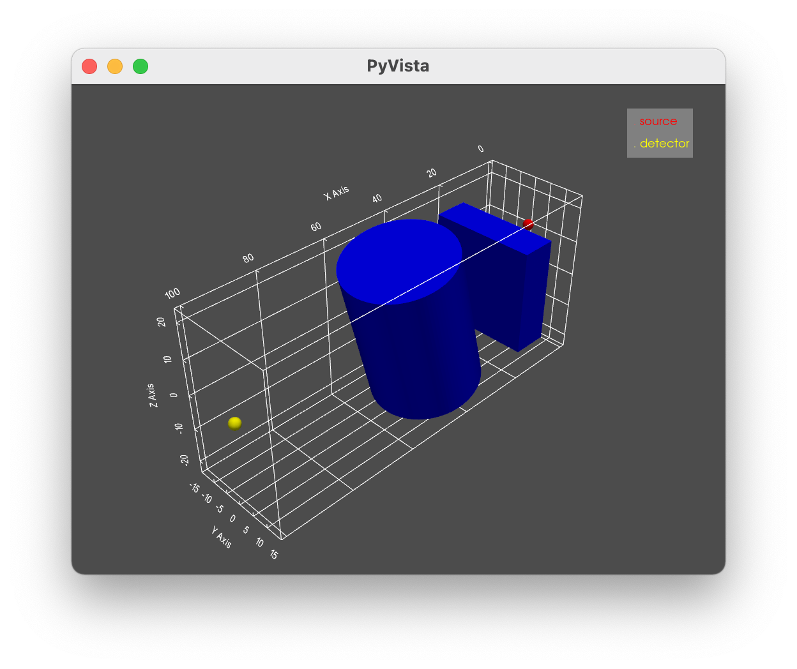
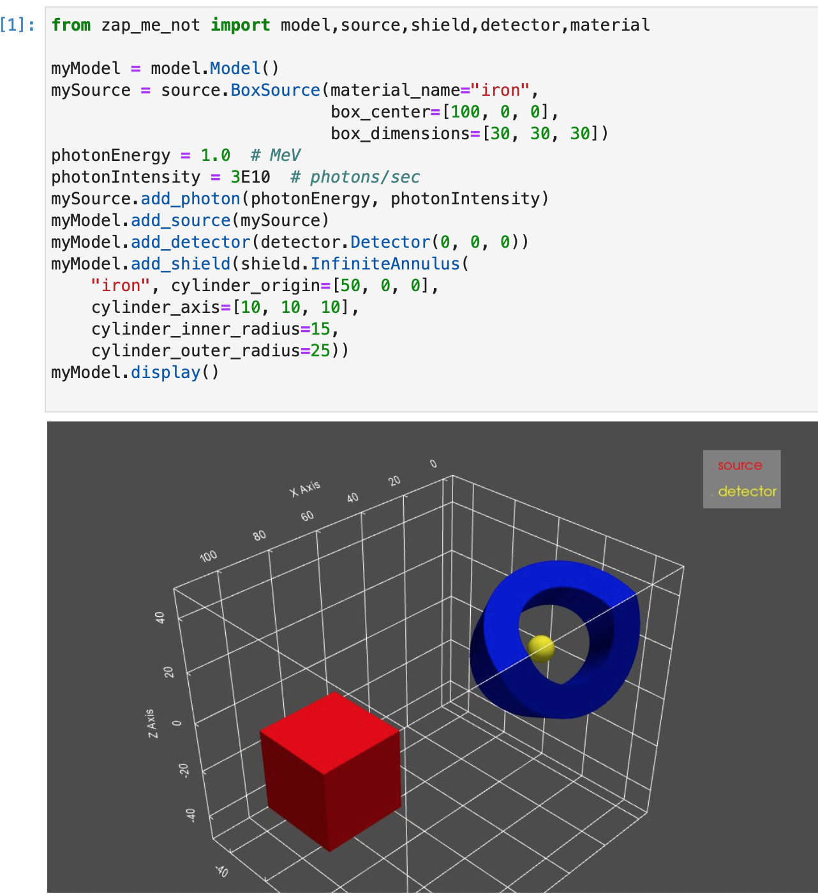

==================
We Want Pictures!
==================
Checking a model geometry can be challenging.  To make the process a little easier
the ZapMeNot library includes the ability to display an interactive view of
the geometry, include source, shields, and detector.  The `Pyvista`_ package is
required to support graphics.

.. _Pyvista: https://docs.pyvista.org

Once you have a model built and populated with a source, detector, and (optionally)
shields, the following command can be used to display the model:

.. code-block:: python

    # display a model
    myModel.display()

Provided you are using a an operating system with graphics capability (i.e. not just a console)
ZapMeNot will display something similar to the following graphic.  In this example the source
is a point source shown in red, the detector is shown in yellow, and two shields are shown
in blue.

The display can be rotated, moved, zoomed, and more by using a mouse or `keyboard shortcuts`_.

.. _keyboard shortcuts: https://docs.pyvista.org/api/plotting/plotting.html

It is possible to display the model on a headless linux server (one with no graphics card)
by building your ZapMeNot model in a `JupyterLab notebook`_.  Pyvista documentation includes
guidance on selecting a `graphics backend`_ for various server configurations.

.. _JupyterLab notebook: https://jupyter.org

.. _graphics backend: https://docs.pyvista.org/user-guide/jupyter/index.html

Here's a screenshot of a JupyterLab notebook.  Your display may look different, depending
on your workstation configuration.

